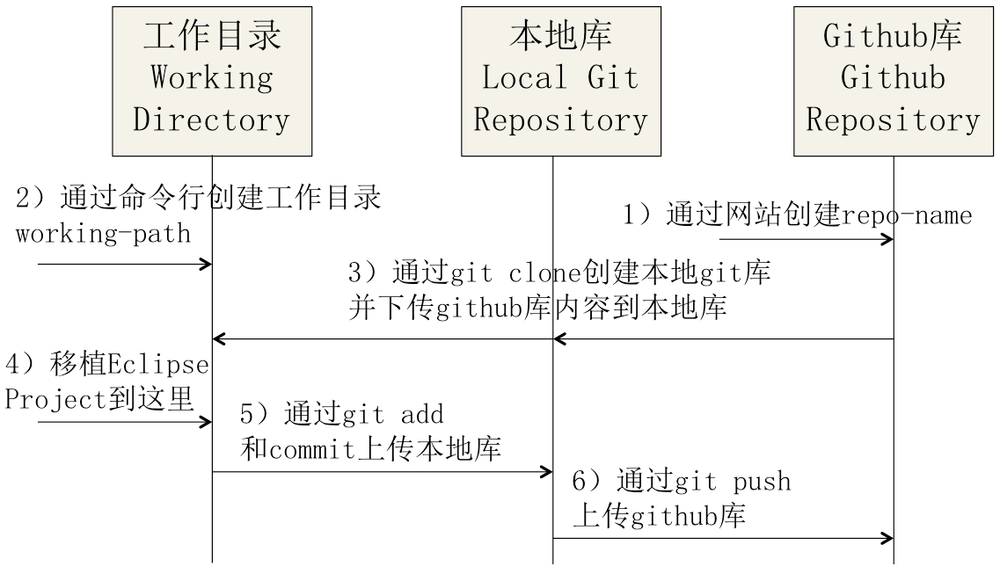
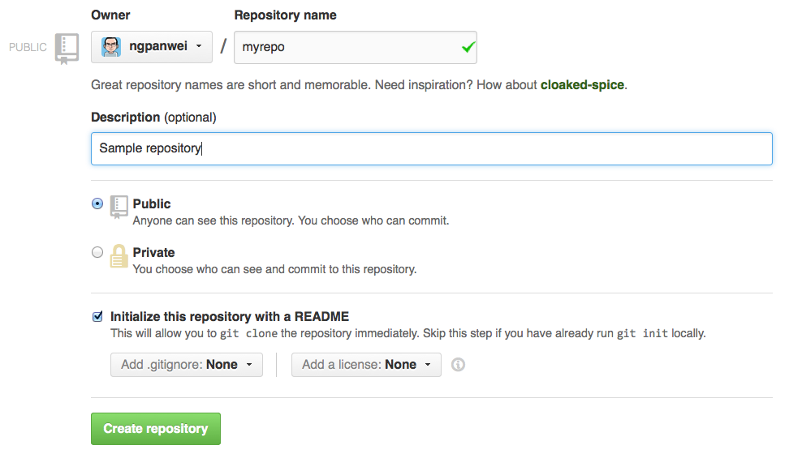
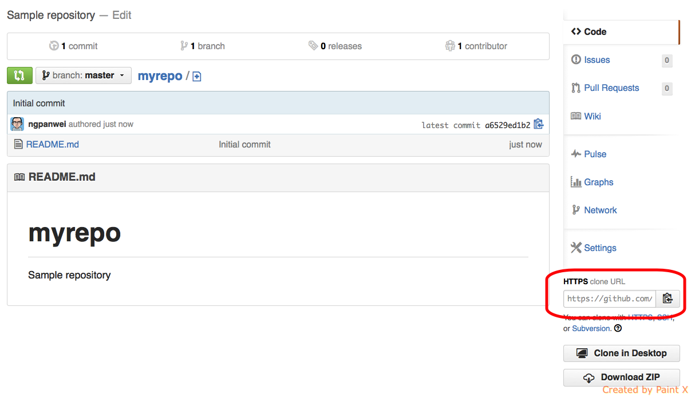
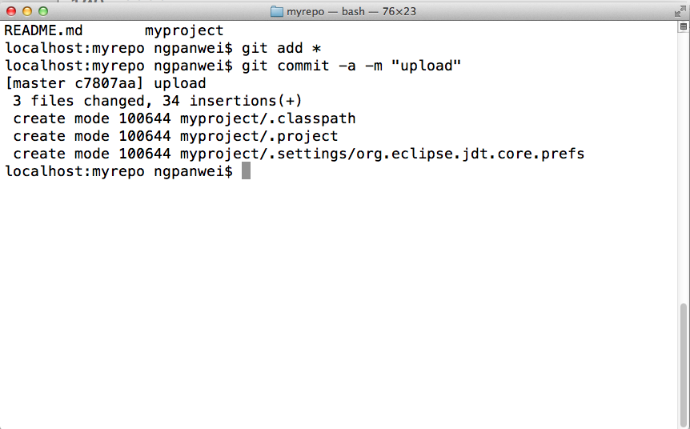
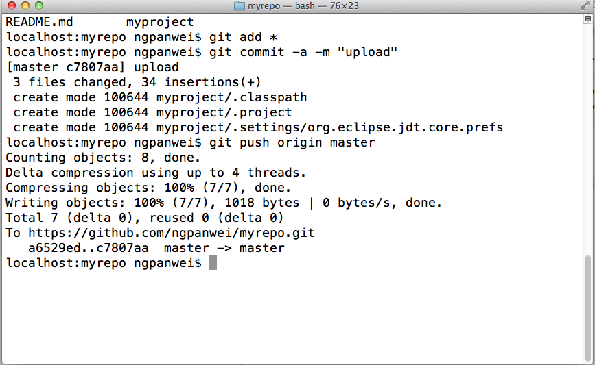
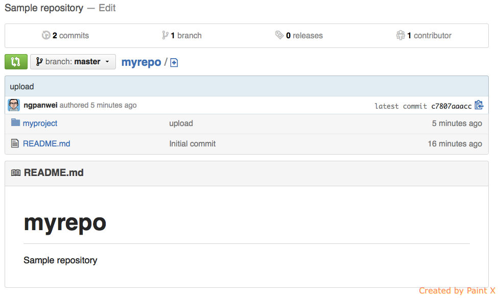

上传Eclipse Project到github
==========================

这文件说明如何通过命令行上传一个已有的Eclipse Project到github的repository。
＊ 我假设你已经安装git命令行工具。
＊ 我假设你已经安装Eclipse。

以下的图片简单描述整个过程和概念:


这个指导有一系列参数。每个参数是通过(parameter)的格式表达。在操作是请替换这些parameter参数。

| Parameter        | Example           | Description  |
| :------------ |:-------------| :-----|
| project-name | myproject | 你的Eclipse Project名 |
| username | ngpanwei  |  你的github账号 |
| email | ********  |  你的注册的email地址 |
| password | *******  |  你的注册的密码 |
| repo-name  | myrepo  | 你的github repository名 |
| git-working-folder | mygit  | 你的本地git工作目录 |
| git-working-path | /Users/ngpanwei/mygit | 你的本地git工作路径  |

### Step－1－创建github repository
目标：通过github网站创建github repository
假设：你已经注册github账号。
游览到你的github账号主页。
````
https://github.com/(username)
````
#### 1.1－网页右上角有个“＋”的菜单栏。点击“＋”选择“New repository”
github弹出一个Repository配置页面。
#### 1.2－输入Repository配置：
````
Repository name ：<-- 输入你想要的repository名 (repo-name) 
Description     ：<-- 输入给个简单描述
Initialize this repository with a README ：勾选
````
点击"Create Repository"



#### 1.3－检查新创建的Repository主页
主页右下角显示这个Repository的路径。路径个格式的:
````
https://github.com/(username)/(repo-name）.git
````
Example(例子):
````
https://github.com/ngpanwei/myrepo.git
````


### Step－2－建立本地Local Repository
目标：通过git命令行工具建立相对的本地Local Repository

#### 2.1－打开你的git命令行工具。
一打开命令行工具，请查你当前的目录
````
> pwd
````

#### 2.2－创建本地git的工作目录
假设你要用(git-working-folder)作为这个目录名
````
mkdir (git-folder)
cd (git-folder)
pwd 
````
Example(例子):
````
mkdir mygit
cd mygit
pwd 
````
记录你的git工作目录路径（git-working-path）。

### Step－3－Clone github 的 Repository
创建本地的相对repository
````
> git clone https://github.com/(username)/(repo-name).git
> ls
````
Example(例子):
````
> git clone https://github.com/ngpanwei/myrepo.git
> ls
````
之后你可以看见一个新的创建目录:（repo-name）


### Step－4－移植你的已有Eclipse Project到你的本地Repository
假设：你已经创建Eclipse Project了而这个Eclipse Project名称是(project-name)

#### 4.1－通过Eclipse Refactor Move移植Eclipse Project
 1. 打开你的Eclipse Project。
 1. 鼠标点击Eclipse Project。右键-->Refactor-->Move
 1. 在Move Project窗口输入
````
Location:(git-working-path)/(project-name)
````
Example(例子):
````
Location:/Users/ngpanwei/mygit/myproject
````


#### 4.2－移植之后确认
在你的命令行工具会看到已被移植的Eclipse Project
````
> ls
````

### Step－5－Add和Commit你的Eclipse Project到本地Repository
现在你可以通过命令行把你的Eclipse Project上传到你的本地git repository
#### 5.1－上传Eclipse Project
````
> git add
> git commit -a -m "upload"
````

#### 5.1－验证正确上传
刷新你的github repository。现在应该能够看到你的Eclipse Project了。

### Step－6－Push你的Eclipse Project到本地Repository
现在你可以通过命令行把你的Eclipse Project上传到你的本地github repository
#### 6.1－上传Eclipse Project
````
> git push origin master
````
如果git问你的username和password，请输入你的注册email和密码。


#### 6.2－验证正确上传
刷新你的github repository。现在应该能够看到你的Eclipse Project了。




